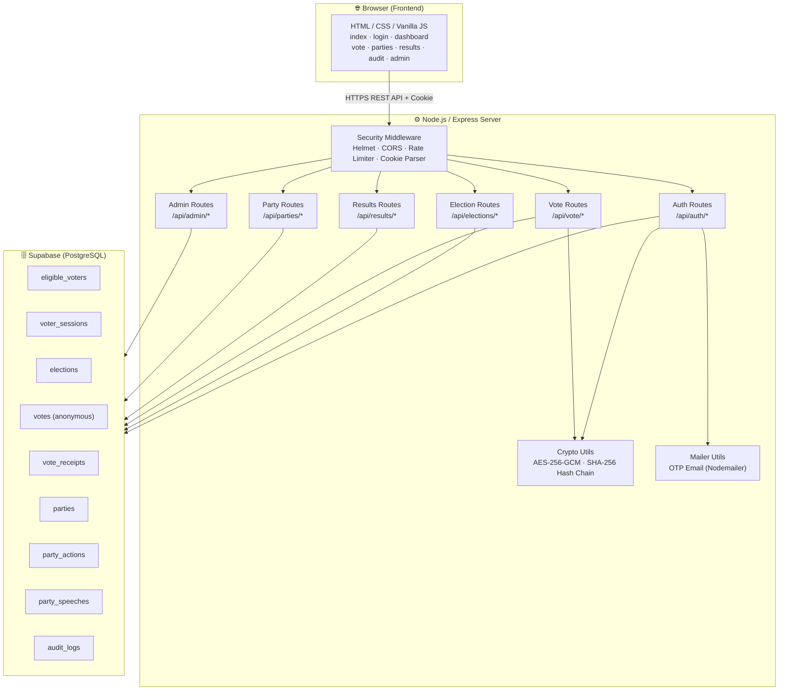
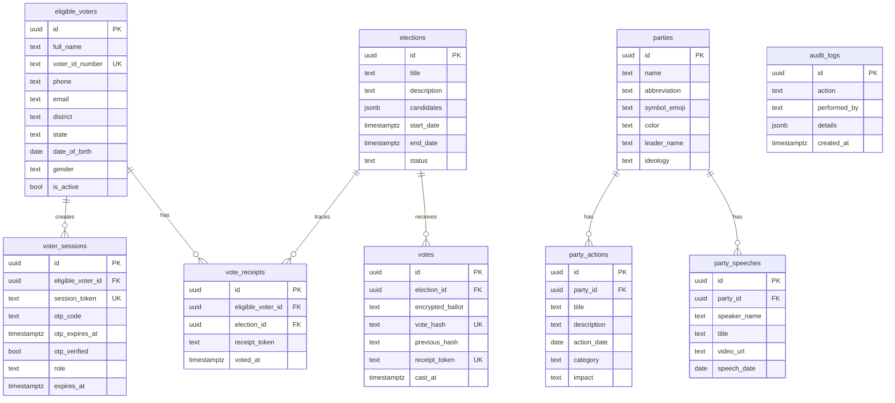
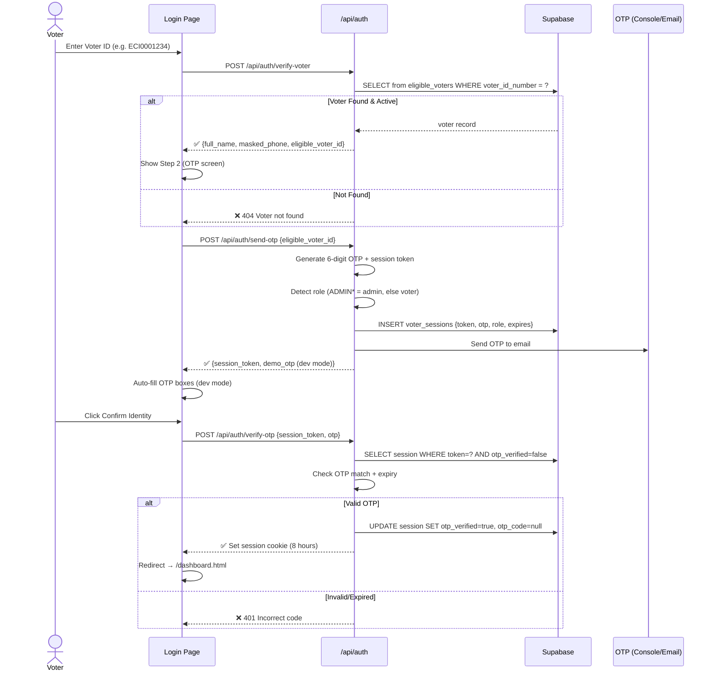

# 🏛️ National E-Voting System — Project Documentation

> **Version:** 1.0.0 | **Stack:** Node.js · Express · Supabase · Vanilla JS

---

## 1. Project Overview

A **secure, anonymous, and transparent** digital voting platform designed for government-grade elections. The system guarantees:

| Property | Mechanism |
|---|---|
| 🔒 **Anonymity** | Votes stored with NO voter reference — blind-token separation |
| 🔗 **Immutability** | SHA-256 hash chain — every vote links to the previous |
| 🛡️ **Security** | 3-step govt ID auth + OTP + session cookie (8hrs) |
| 🚫 **No Dual Voting** | Unique constraint on `(voter_id, election_id)` in `vote_receipts` |
| 🌐 **Transparency** | Public audit trail — anyone can verify the chain integrity |

---

## 2. High-Level Architecture



---

## 3. Database Schema



> **Key Design:** `votes` has **NO** reference to `eligible_voters` — this is the anonymity guarantee. `vote_receipts` tracks *who* voted *where*, but NOT *what* they voted for.

---

## 4. Authentication Flow



---

## 5. Vote Casting Flow

```mermaid
flowchart TD
    A([Voter Opens Vote Page]) --> B[Load election details\nGET /api/elections/:id]
    B --> C{Already voted?}
    C -->|Yes| D[Show receipt + voted badge]
    C -->|No| E[Render Candidate Cards]
    E --> F[Voter clicks a candidate\nCard highlights blue ✓]
    F --> G[Click 'Confirm Selection']
    G --> H[Confirmation Modal Opens\nShows name, party, warning]
    H --> I{Voter confirms?}
    I -->|Cancel| F
    I -->|Submit| J[POST /api/vote/:electionId\nbody: candidate_id]

    subgraph Server["⚙️ Backend Processing"]
        J --> K[requireAuth middleware\nVerify session cookie]
        K --> L{Duplicate check:\nvote_receipts table}
        L -->|Already voted| M[❌ 403 Already voted]
        L -->|First vote| N[Encrypt ballot\nAES-256-GCM]
        N --> O[Compute vote hash\nSHA-256 of encrypted_ballot]
        O --> P[Fetch last vote hash\nas previous_hash]
        P --> Q[Insert into votes\nNO voter reference!]
        Q --> R[Insert into vote_receipts\nvoter_id + election_id only]
        R --> S[Generate receipt token\nRandom UUID]
    end

    S --> T[Return receipt_token + vote_hash]
    T --> U[Display Receipt Screen\nSave token to verify later]

    style Q fill:#1e3a5f,stroke:#3b82f6
    style R fill:#1a3a2a,stroke:#10b981
    style M fill:#3a1a1a,stroke:#ef4444
```



---

## 6. Hash Chain (Tamper-Evidence)


> If **any** vote in the chain is tampered with, its hash changes, breaking every subsequent link. The audit page verifies the entire chain publicly.

---

## 7. Project File Structure

```
E_votting system/
│
├── server.js                   ← Express app entry point
├── package.json
├── .env                        ← Secrets (Supabase, JWT, SMTP)
│
├── config/
│   └── supabase.js             ← Supabase service-role client
│
├── middleware/
│   └── auth.js                 ← requireAuth / requireAdmin guards
│
├── routes/
│   ├── authRoutes.js           ← 3-step voter ID → OTP → session
│   ├── electionRoutes.js       ← CRUD elections, participation check
│   ├── voteRoutes.js           ← Anonymous vote cast + receipt verify
│   ├── resultsRoutes.js        ← Tally + audit chain endpoint
│   ├── partyRoutes.js          ← Parties, actions, speeches
│   └── adminRoutes.js          ← Voter management, stats, logs
│
├── utils/
│   ├── crypto.js               ← AES-256 encrypt, SHA-256 chain, OTP gen
│   └── mailer.js               ← Nodemailer OTP sender
│
├── supabase/
│   ├── schema.sql              ← Full DB schema + RLS policies
│   └── seed.sql                ← Demo voters, parties, election
│
└── public/                     ← Static frontend
    ├── index.html              ← Landing page
    ├── login.html              ← Govt ID verification (3-step)
    ├── dashboard.html          ← Voter home, elections list
    ├── vote.html               ← Voting booth
    ├── parties.html            ← Party transparency portal
    ├── results.html            ← Live election results
    ├── audit.html              ← Public hash-chain verifier
    ├── admin.html              ← Admin control panel
    ├── css/style.css           ← Full design system (dark mode)
    └── js/
        ├── app.js              ← Shared: API client, Auth, navbar, toasts
        ├── auth.js             ← Login page logic
        ├── dashboard.js        ← Dashboard page logic
        ├── vote.js             ← Voting booth logic
        ├── parties.js          ← Party portal logic
        ├── results.js          ← Results page logic
        ├── audit.js            ← Audit trail logic
        └── admin.js            ← Admin panel logic
```

---

## 8. Security Layers

```mermaid
graph TD
    R["Incoming Request"] --> HL["Helmet\nContent-Security-Policy\nXSS / Clickjacking headers"]
    HL --> RL["Rate Limiter\nDev: 100 req/min\nProd: 10 req/15min on /auth"]
    RL --> CORS["CORS\nOrigin whitelist only"]
    CORS --> CK["Cookie Parser\nHTTP-only session cookie"]
    CK --> AUTH["requireAuth middleware\nValidate session token vs DB\nCheck expiry"]
    AUTH --> ADMIN{"Admin route?"}
    ADMIN -->|Yes| ROLE["requireAdmin\nVerify role === 'admin'"]
    ADMIN -->|No| HANDLER["Route Handler"]
    ROLE --> HANDLER
    HANDLER --> RLS["Supabase RLS\nRow Level Security\nService role enforced"]

    style HL fill:#1a3a6b,stroke:#60a5fa
    style RL fill:#3a2a0d,stroke:#f59e0b
    style AUTH fill:#1a3a2a,stroke:#10b981
    style ROLE fill:#3a1a1a,stroke:#ef4444
    style RLS fill:#1a1a3a,stroke:#8b5cf6
```



---

## 9. Key API Endpoints

| Method | Endpoint | Auth | Description |
|---|---|---|---|
| POST | `/api/auth/verify-voter` | Public | Check voter ID against registry |
| POST | `/api/auth/send-otp` | Public | Create session + send OTP |
| POST | `/api/auth/verify-otp` | Public | Verify OTP → set session cookie |
| POST | `/api/auth/logout` | Any | Clear session |
| GET | `/api/elections` | Voter | List elections + voted status |
| GET | `/api/elections/:id` | Voter | Election details |
| POST | `/api/vote/:electionId` | Voter | Cast anonymous vote |
| GET | `/api/vote/receipt/:token` | Public | Verify vote was counted |
| GET | `/api/results/:id` | Public | Election tally |
| GET | `/api/results/:id/audit` | Public | Full hash chain |
| GET | `/api/parties` | Public | All parties |
| GET | `/api/parties/:id/actions` | Public | Party actions |
| GET | `/api/parties/:id/speeches` | Public | Party speeches |
| GET | `/api/admin/stats` | Admin | System stats |
| GET | `/api/admin/voters` | Admin | All registered voters |
| POST | `/api/admin/voters` | Admin | Add new voter |
| PATCH | `/api/admin/voters/:id/toggle` | Admin | Activate/deactivate voter |
| PATCH | `/api/elections/:id/status` | Admin | Change election status |
| GET | `/api/admin/logs` | Admin | Recent audit logs |

---

## 10. Demo Credentials

| Role | Voter ID | What it does |
|---|---|---|
| Voter | `ECI0001234` | Rajesh Kumar Sharma, New Delhi |
| Voter | `ECI0002345` | Priya Singh, Mumbai |
| Voter | `ECI0003456` | Amit Patel, Ahmedabad |
| Admin | `ADMIN00001` | Full admin portal access |

> **OTP in dev mode:** Appears auto-filled on the login page (no email needed). Configure `EMAIL_*` in `.env` for real OTP delivery.

---

## 11. Tech Stack Summary

| Layer | Technology | Purpose |
|---|---|---|
| **Runtime** | Node.js v18+ | JavaScript server runtime |
| **Framework** | Express 5 | HTTP routing & middleware |
| **Database** | Supabase (PostgreSQL) | Managed DB + Row Level Security |
| **Auth** | Session cookie + OTP | Govt-style 2-factor verification |
| **Encryption** | AES-256-GCM | Ballot confidentiality at rest |
| **Integrity** | SHA-256 hash chain | Tamper-evident vote ledger |
| **Email** | Nodemailer | OTP delivery |
| **Security** | Helmet, CORS, rate-limit | HTTP hardening |
| **Frontend** | Vanilla HTML/CSS/JS | No framework, max performance |
| **Design** | Custom dark glassmorphism | Premium govt-style UI |
| **Dev Server** | Nodemon | Auto-restart on file change |
